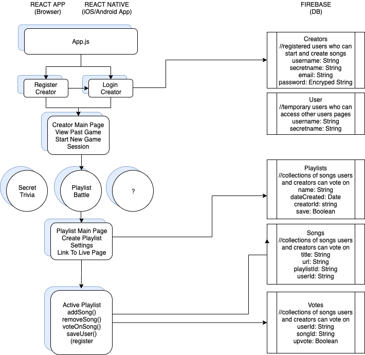

# Song Mingle App
[React Native Repo](https://github.com/AnnaFinnerty/mingle-native)

## Scope of Work

Build app to allows a group of users (invited by one playlist creator) to collectively create a playlist and (optionally) vote on what songs remain in the list.

Users can optionally remain anonymous until voting has completed.

## Model Relationship

## Milestones

* Working React app hosted on Heroku
* Working Native app hosted on App store
* QR codes

## User Stories/Feasability Study
[Trello Board](https://trello.com/b/8fL8Ja7h/introvert-mingle)
